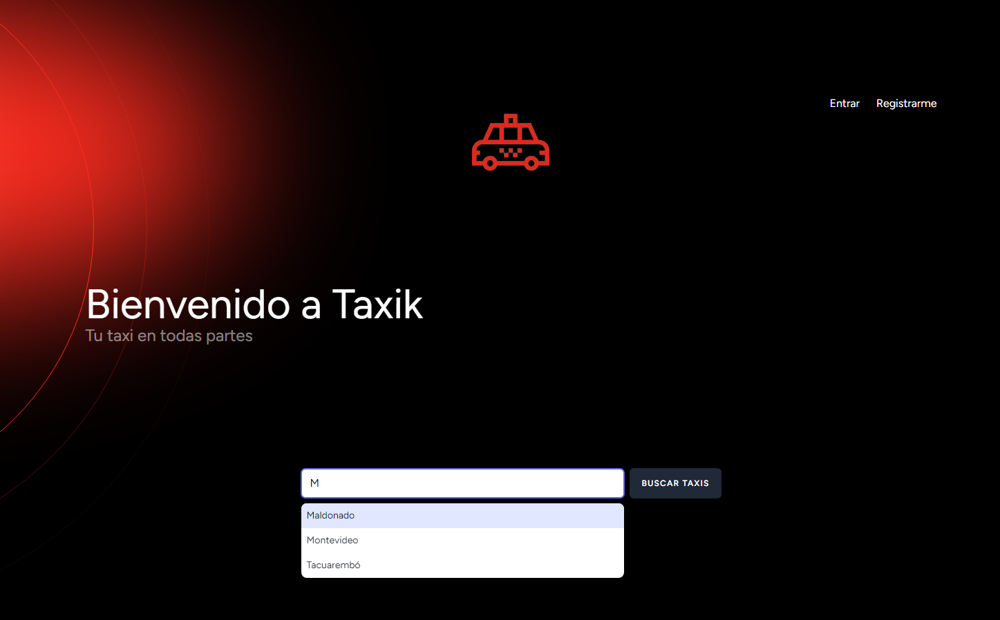
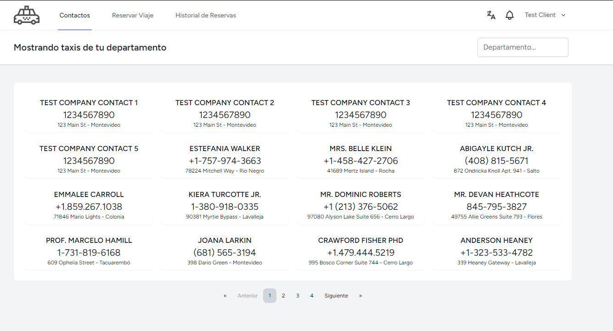
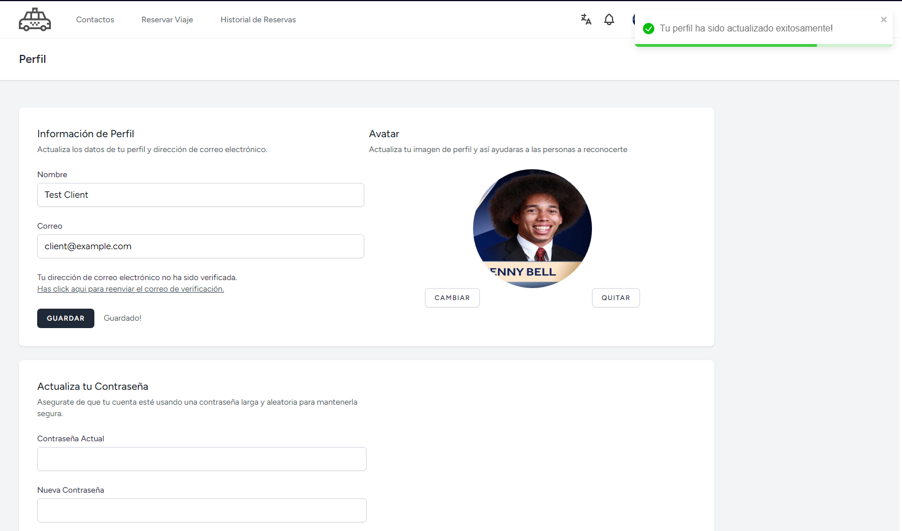
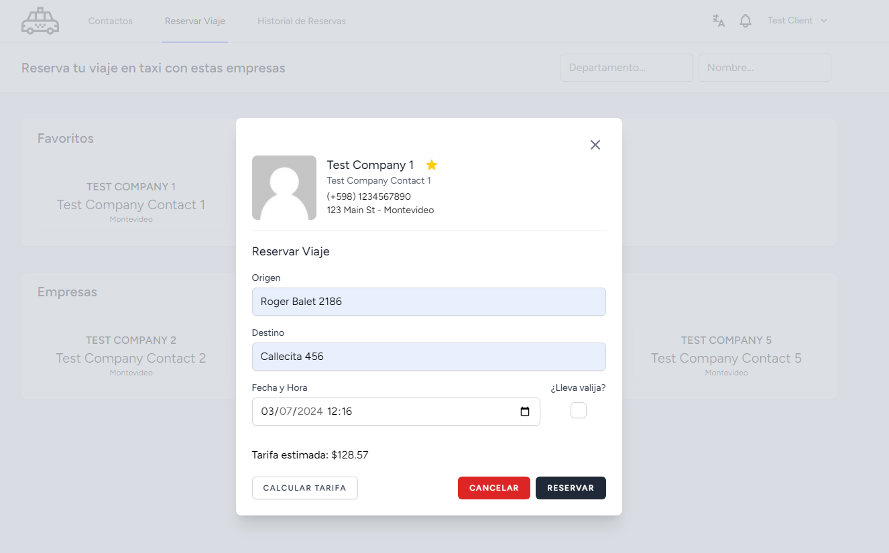
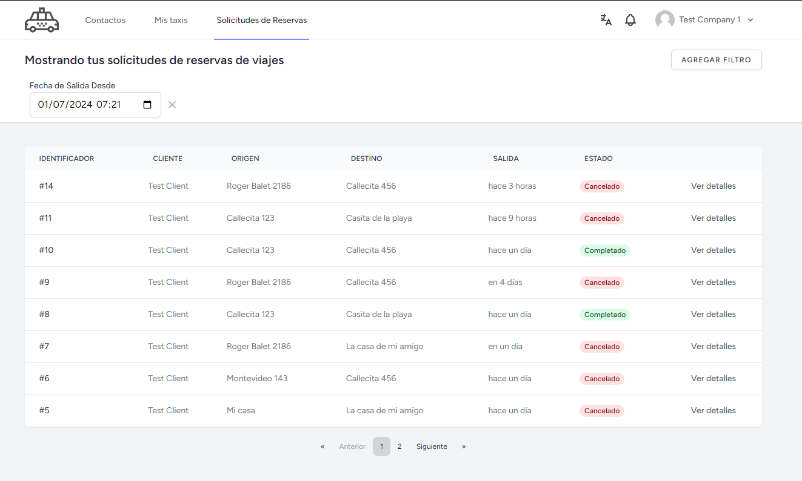

<p style="display: flex; align-items: center; justify-content: center">

</p>

<p style="display: flex; align-items: center; justify-content: center">
<a href="https://laravel.com" target="_blank"></a>
<a href="https://reactjs.org/" target="_blank"></a>
</p>

# Introducción

Taxik es una aplicación web que promete brindar a los residentes de las ciudades de Uruguay una forma rápida y segura de solicitar un taxi. La aplicación permite a los conductores de taxi registrarse y ofrecer sus servicios a los usuarios.

Además, permite a los usuarios solicitar viajes de taxi de forma rápida y segura. La aplicación cuenta con un sistema de notificaciones en tiempo real para mantener a los usuarios informados sobre el estado de sus viajes.

## Características

-   Registro de usuarios y empresas de taxis
-   Inicio de sesión
-   Listado de contactos de taxis por departamento
-   Solicitar reserva de viaje online
-   Ver historial de viajes
-   Manejo de perfil de usuario
-   Gestion de usuarios y empresas de taxis
-   Gestion de taxis por empresa
-   Notificaciones en tiempo real
-   Internacionalización (español e inglés)

## Capturas de pantalla











# Guia de instalación

## Requerimientos

-   Laravel >= 11
-   PHP >= 8.2
-   Composer >= 2.7
-   NodeJS >= 18.18
-   NPM >= 9.8
-   Vite
-   Base de datos MySQL

## Instalación

Instalar librerias de laravel con [composer](https://getcomposer.org):

```sh
composer install
```

Instalar dependencias de node con [npm](https://www.npmjs.com):

```sh
npm i
```

## Configuración

### Variables de entorno

Crear archivo de configuración de laravel en donde se definen las variables de entorno:

```sh
cp .env.example .env
```

Generar clave de aplicación:

```sh
php artisan key:generate
```

### Migraciones y Seeders de la base de datos

> **Nota:** Es necesario tener una base de datos creada y configurar las credenciales en el archivo `.env`.

Ejecutar migraciones para crear las tablas en la base de datos:

```sh
php artisan migrate
```

Ejecutar seeders para poblar las tablas con datos de prueba:

```sh
php artisan db:seed
```

### Compilación

Compilar archivos de javascript y css:

```sh
npm run dev
```

Esto a su vez generará los archivos de traducción en formato json, para el uso del frontend. Puedes verlos en la carpeta `lang/../php_*.json`.

## Levantar ambiente de desarrollo

> **Nota**: Asegurate de tener tu servicio de base de datos MySQL corriendo.

Se deberan de ejecutar los siguientes comandos para levantar el servidor de desarrollo:

#### Mantener la compilación de archivos de javascript y css en modo de desarrollo:

```sh
npm run dev
```

#### Levantar servidor de desarrollo de laravel:

```sh
php artisan serve
```

#### Levantar modulo Reverb para la comunicación por socket, para las notificaciones en tiempo real:

```sh
php artisan reverb:start
```

#### Escuchar por la cola de trabajos (esto tanto para los sockets como para otros eventos de laravel):

```sh
php artisan queue:listen
```

## Acceso a la aplicación con datos de prueba

Al ejecutar los seeders, se crean los siguientes usuarios de prueba:

#### Cliente

-   **Usuario**: `client@example.com`
-   **Contraseña**: `12345678`

#### Empresa

-   **Usuario**: `company1@example.com`
-   **Contraseña**: `12345678`

#### Administrador

-   **Usuario**: `admin@example.com`
-   **Contraseña**: `12345678`

Se pueden utilizar estos usuarios para acceder a la aplicación y probar las funcionalidades. También se pueden registrar nuevos usuarios.

## Tecnologías y dependencias utilizadas

-   [Laravel](https://laravel.com)
    -   [Inertia.js](https://inertiajs.com)
    -   [Breeze](https://laravel.com/docs/11.x/starter-kits#laravel-breeze)
    -   [Reverb](https://reverb.laravel.com/)
-   [React](https://reactjs.org)
    -   [Vite](https://vitejs.dev)
    -   [Tailwind CSS](https://tailwindcss.com)
    -   [Day.js](https://day.js.org)
    -   [Laravel React i18n](https://day.js.org/)
    -   [Toastify](https://fkhadra.github.io/react-toastify/)

## Licencia

Este proyecto fue desarrollado por estudiantes de la Universidad Tecnológica del Uruguay (UTEC) y se encuentra bajo la licencia [MIT](https://opensource.org/licenses/MIT).
